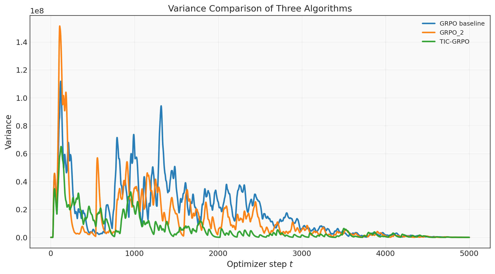
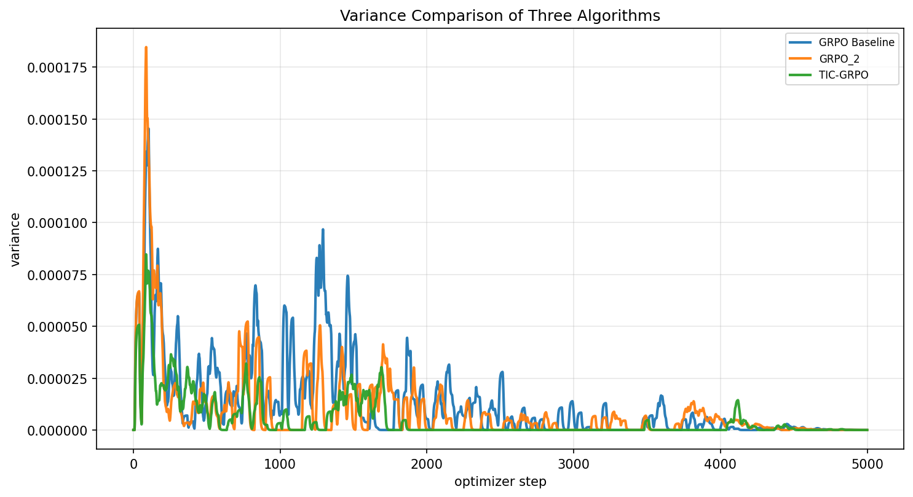
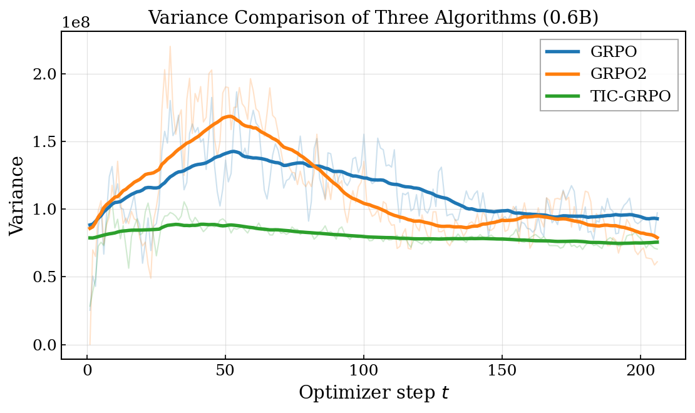
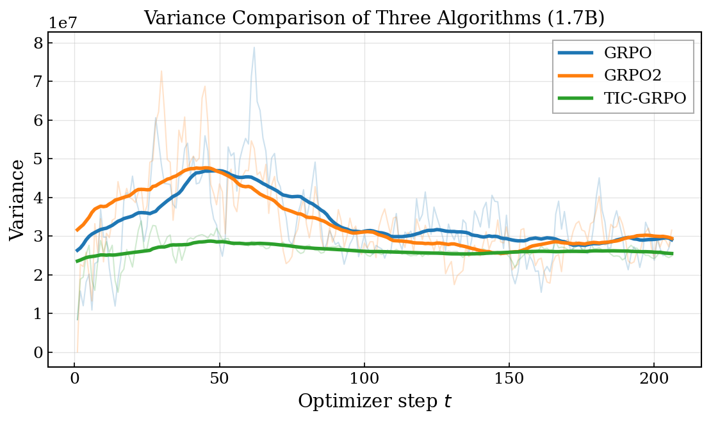

# Supplementary Figures

This repository contains supplementary figures for anonymous submission.

## Figures

### trl-lib/DeepMath-103K

This figure presents the experimental results for Qwen2.5-0.5B-Instruct on the trl-lib/DeepMath-103K dataset.

This figure presents the experimental results for Qwen3-1.7B on the trl-lib/DeepMath-103K dataset.

### DAPO-Math-17K (VeRL)

This figure presents the experimental results for Qwen3-0.6B on the DAPO-Math-17K dataset using the VeRL framework.

This figure presents the experimental results for Qwen3-1.7B on the DAPO-Math-17K dataset using the VeRL framework.

